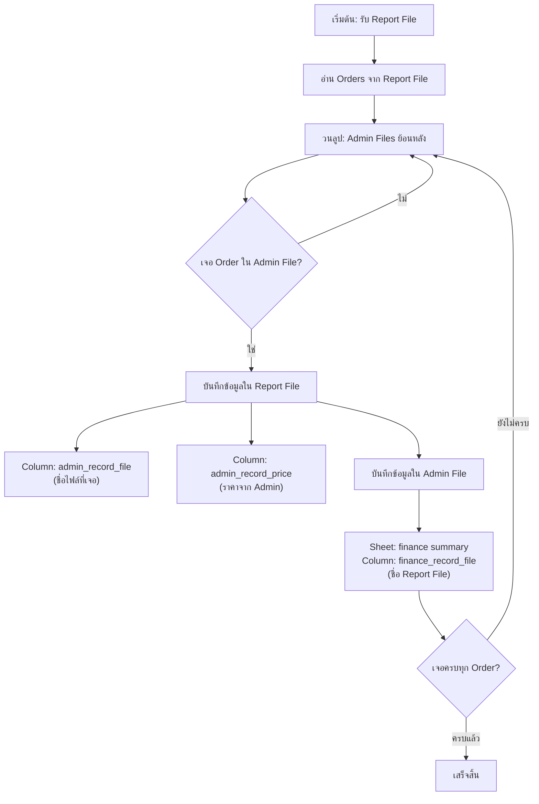
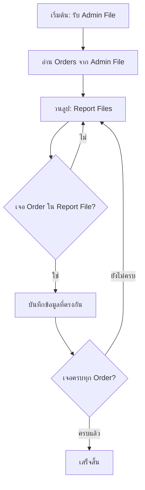

# Finance Check Functions

## ภาพรวม (Overview)

ระบบนี้ทำหน้าที่ตรวจสอบและจับคู่ข้อมูล orders ระหว่าง 2 ไฟล์:
- **Report File**: ไฟล์รายงานการเงินจาก platform (เช่น Shopee, Lazada, TikTok)
- **Admin File**: ไฟล์ที่ admin สร้างขึ้นเพื่อบันทึก orders

### ทำไมต้องมีระบบนี้?

เนื่องจาก platform จะจ่ายเงินให้ seller **หลังจากลูกค้ากดรับสินค้า** ดังนั้น order ที่ได้รับการชำระเงินในรายงานการเงินอาจเป็น order ที่สร้างไว้นานแล้ว (มากกว่า 2 สัปดาห์) ทำให้ต้องค้นหาย้อนหลังในหลายไฟล์

---

## Flow Diagram

### 1. Finance Check Flow


### 2. Admin Check Flow (ทางกลับกัน)


---

## Function Specifications

### 1. Finance Check Function

**วัตถุประสงค์**: ตรวจสอบ orders จาก report file ว่าอยู่ใน admin file ไหน

```python
@staticmethod
def finance_check(report_file: str, admin_file: str) -> None:
    """
    ตรวจสอบ orders จาก report file และจับคู่กับ admin files
    
    Args:
        report_file: ไฟล์รายงานการเงินจาก platform (ที่มี orders ที่ได้รับชำระเงินแล้ว)
        admin_file: ไฟล์ admin หรือ pattern สำหรับค้นหาหลายไฟล์
    
    Process:
        1. อ่าน orders จาก report_file
        2. วนลูปค้นหา admin files ย้อนหลัง (เรียงตามวันที่)
        3. เมื่อเจอ order ที่ตรงกัน:
           - บันทึกใน report_file:
             * admin_record_file (ชื่อไฟล์ที่พบ)
             * admin_record_price (ราคาจาก admin)
           - บันทึกใน admin_file (sheet: finance summary):
             * finance_record_file (ชื่อ report file)
        4. หยุดเมื่อเจอครบทุก order
    """
    pass
```

### 2. Admin Check Function

**วัตถุประสงค์**: ตรวจสอบ orders จาก admin file ว่าปรากฏใน report file ไหนบ้าง (ตรวจสอบทางกลับกัน)

```python
@staticmethod
def admin_check(admin_file: str, report_file: str) -> None:
    """
    ตรวจสอบ orders จาก admin file และจับคู่กับ report files
    
    Args:
        admin_file: ไฟล์ที่ admin สร้างขึ้น
        report_file: ไฟล์รายงานการเงินจาก platform หรือ pattern สำหรับค้นหา
    
    Process:
        1. อ่าน orders จาก admin_file
        2. วนลูปค้นหา report files
        3. เมื่อเจอ order ที่ตรงกัน: บันทึกข้อมูลการจับคู่
        4. หยุดเมื่อเจอครบทุก order
    """
    pass
```

---

## Data Structure

### Report File Columns
| Column Name | Description |
|-------------|-------------|
| `admin_record_file` | ชื่อไฟล์ admin ที่พบ order นี้ |
| `admin_record_price` | ราคาที่บันทึกใน admin file |

### Admin File (Sheet: finance summary)
| Column Name | Description |
|-------------|-------------|
| `finance_record_file` | ชื่อไฟล์ report ที่พบ order นี้ |

---

## Use Cases

### กรณีที่ 1: ตรวจสอบว่า orders ใน report ถูกบันทึกครบหรือไม่
```python
finance_check('shopee_report_2025-12.xlsx', 'shopee_admin_*.xlsx')
```

### กรณีที่ 2: ตรวจสอบว่า orders ใน admin ได้รับเงินแล้วหรือยัง
```python
admin_check('shopee_admin_2025-11-15.xlsx', 'shopee_report_*.xlsx')
```
